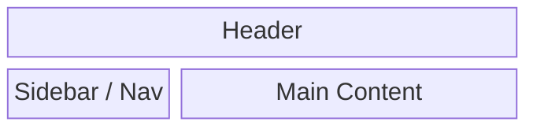

# Wireframe Template

# 1. Page 名稱
- 

---

# 2. Page 目的
- 這一頁要解決什麼問題

---

# 3. Layout 結構
<!-- VSCode 需安裝 "Markdown Preview Mermaid Support"（bierner.markdown-mermaid）才能在 preview 看到圖表，GitHub 上原生支援 -->

---

# 4. 區塊拆解

## Section 1：{區塊名稱}
- 位置：
- 目的：

## Section 2：
- 位置：
- 目的：

---

# 5. 互動說明
- 哪些區塊可以點
- 哪些會觸發行為