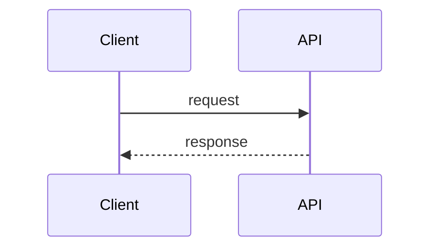

<!--
architecture.md = 全局藍圖（system-level），只回答「系統長什麼樣子」。
不要放：
- 單一 module 的內部實作方式 → 那是 system-design.md 的職責
- 為什麼選這個方案 → 那是 adr/ 的職責
- 實作步驟 → 那是 task-list.yaml 的職責
-->

# 1. System Context

<!-- 誰／什麼會跟這個系統互動：使用者、外部系統、第三方服務 -->

| 角色 | 類型 | 說明 |
|---|---|---|
|  | user / external-system / third-party |  |

---

# 2. Major Components

<!-- 系統由哪些主要元件組成，每個元件對應後續 system-design.md 的一個 Module -->

| component_id | name | responsibility |
|---|---|---|
| `comp-api` |  |  |
| `comp-web` |  |  |

---

# 3. Service Boundaries

<!-- 每個元件的職責邊界：它擁有什麼、不擁有什麼 -->

| component_id | owns | does not own |
|---|---|---|
| `comp-api` |  |  |

---

# 4. Data Flow Overview

<!-- 只畫「元件之間」的資料流向，不畫元件內部細節 -->

---

# 5. Traceability

- srs.md：對應需求 id
- ui-spec.md：對應 screen_id / component_id
- 對應 module 詳細設計：見 system-design.md
- 對應決策紀錄：見 adr/
