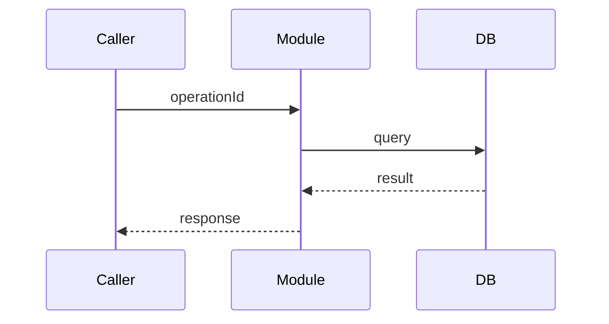

<!--
system-design.md = 模組級設計（module-level），一個 "## Module: {module_id}" 區塊 = 一個 module。
module_id 必須對應 architecture.md 的 Major Components 表格中的 component_id。
不要放：
- 全局系統圖 / 元件清單 → 那是 architecture.md 的職責（不要重複畫）
- 為什麼選這個技術 / 這個做法 → 那是 adr/ 的職責，這裡只引用 adr_ref
- 實作步驟拆解 → 那是 task-list.yaml 的職責
-->

# Module: `comp-api`

## 1. Meta
- name:
- owns（對應 architecture.md 的 component_id）: `comp-api`
- responsibility:
- adr_ref: <!-- 影響此 module 設計的決策，例如 [adr-0001] -->

---

## 2. 內部設計（怎麼做）

<!-- module 內部怎麼組成：子模組 / class / layer，只描述結構，不描述原因 -->

| 子模組 | 職責 |
|---|---|
|  |  |

---

## 3. API Flow

<!-- 此 module 對外暴露 / 對外呼叫的 API，操作對應 specs/03-api/openapi.yaml 的 operationId -->

| operationId | 方向（in/out） | 對應對象 |
|---|---|---|
|  | in |  |

---

## 4. Data Flow Detail

<!-- module 內部的資料如何轉換，欄位級／步驟級細節；對應 specs/04-data/data-model.md 的 entity -->

| 步驟 | 輸入 | 處理 | 輸出 |
|---|---|---|---|
| 1 |  |  |  |

---

## 5. Integration

<!-- 這個 module 依賴 / 被依賴的其他 module 或外部服務 -->

| 對象 | 類型（module/external） | 溝通方式（sync/async, protocol） | 說明 |
|---|---|---|---|
|  | module |  |  |

---

<!-- 若有第二個 module，複製上方整個 "# Module: {module_id}" 區塊並換上新的 module_id -->
