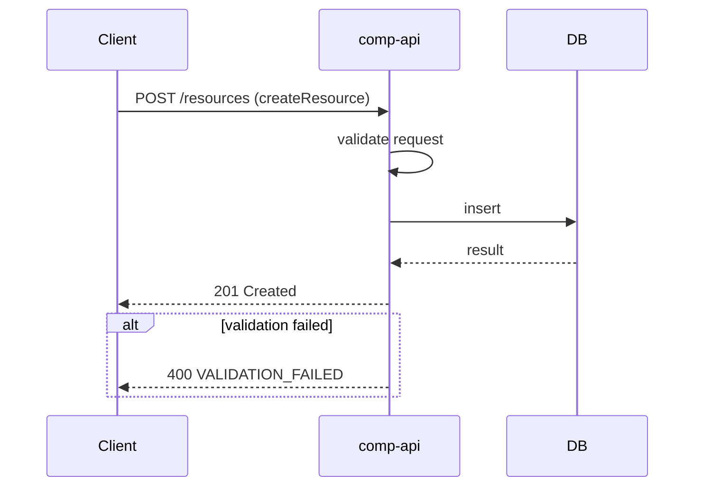

<!--
sequence-diagrams.md = 請求在「多個系統／服務之間」如何流動（跨服務、端到端視角）。
與 system-design.md 的「API Flow」不同：
- system-design.md 的 API Flow = 單一 module 的視角（它暴露/呼叫了哪些 operationId）
- 這裡的 sequence diagram = 端到端視角，橫跨多個 module／外部服務，呈現完整請求生命週期
一個 "## Flow: {flow_id}" = 一條跨服務流程，operationId 必須對應 openapi.yaml。
不要放：
- 單一 module 內部怎麼處理 → system-design.md
- 錯誤碼列舉 → error-codes.md（這裡只標示「在哪一步可能失敗」）
-->

# Flow: `flow-create-resource`

## 1. Meta
- 對應 operationId: `createResource`
- 觸發情境：

---

## 2. Sequence

---

## 3. Steps

| 步驟 | 發起方 | 接收方 | 說明 | 可能失敗 |
|---|---|---|---|---|
| 1 | Client | comp-api |  | `VALIDATION_FAILED` |
| 2 | comp-api | DB |  | `INTERNAL_ERROR` |

---

<!-- 若有第二條 flow，複製上方整個 "# Flow: {flow_id}" 區塊並換上新的 flow_id -->
